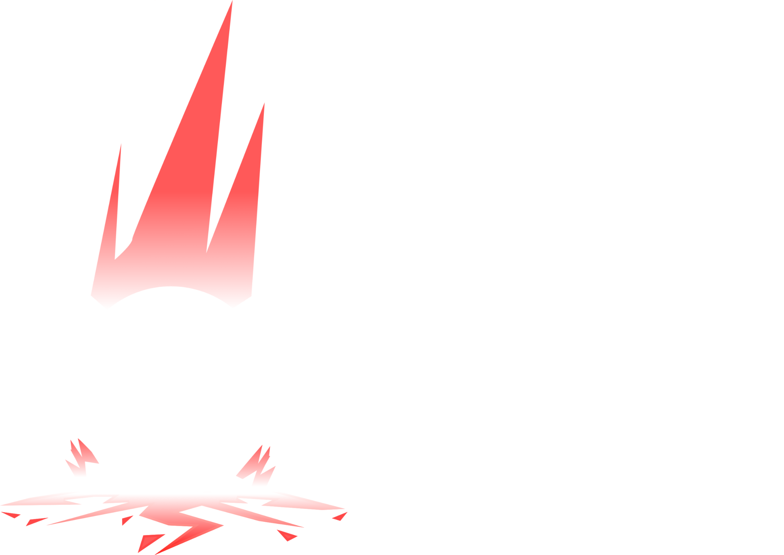

</img>
<h1>Calamity Engine</h1>

A modular and cross-platform 2D game engine made in SDL3 and C++ built in mind with the Sony PSP.

# Stuff you should look at

 - [Installation](https://calamity.sl4shed.xyz/)
 - [Getting Started](https://calamity.sl4shed.xyz/)
 - [Cross Compilation](https://calamity.sl4shed.xyz)

# [Platforms that I support atm](https://calamity.sl4shed.xyz)

 - Linux
 - Windows
 - Sony PSP
 - Web browsers (emscripten)

# Libraries used

 - [SDL3](https://github.com/libsdl-org/SDL)
 - [SDL3_image](https://github.com/libsdl-org/SDL_image)
 - [SDL3_ttf](https://github.com/libsdl-org/SDL_ttf)
 - [cereal](https://github.com/USCiLab/cereal)
 - [spdlog](https://github.com/gabime/spdlog)
 - [box2d](https://github.com/erincatto/box2d)
 - [SDL_GameControllerDB](https://github.com/mdqinc/SDL_GameControllerDB)
 - [doxygen-awesome-css](https://github.com/jothepro/doxygen-awesome-css)

# Aknowledgements

 - [Hack Club](https://hackclub.com) ❤️
 - My friends that are smarter than me ([@art0007i](https://github.com/art0007i/), [@misleadingname](https://codeberg.org/misleadingname), [@vianraaa](https://github.com/vianraaa))